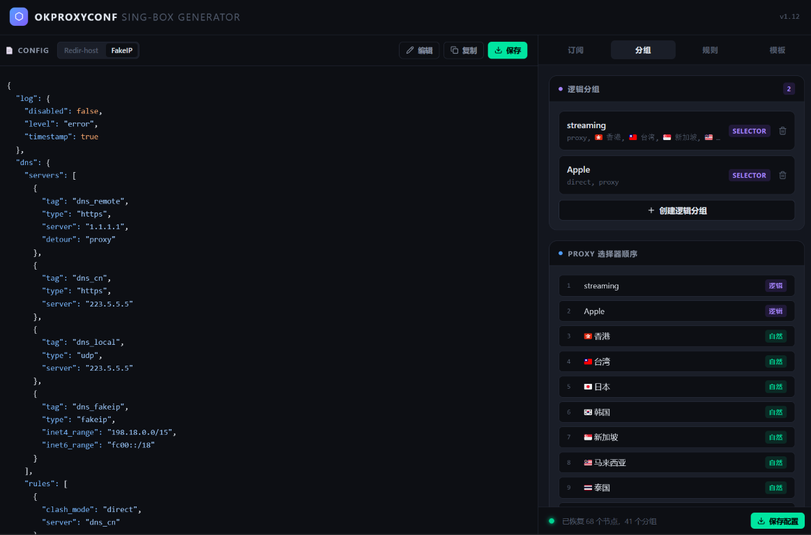

# OkProxyConf

A browser-based SingBox config generator. Paste or fetch your proxy subscription, configure routing groups and rule sets, and download a ready-to-use `config.json`.



---

## Features

- **Auto-detect subscription format** — Clash YAML, V2Ray Base64, SingBox JSON, URI list (`ss://` `vmess://` `vless://` `trojan://` `hysteria2://` `tuic://` and more)
- **Direct URL fetch** — paste a subscription link and fetch it in one click; falls back to paste mode on CORS errors
- **Multi-source merge** — load from multiple URLs or mix URL + paste, nodes are deduplicated automatically
- **Geographic auto-grouping** — nodes are clustered by region using emoji flags, Chinese keywords, and Latin abbreviations; unrecognized nodes are grouped by common prefix
- **Logic groups** — create `selector` or `urltest` groups that reference natural groups; useful for streaming, gaming, AI services, etc.
- **Rule sets** — add remote rule sets with per-entry outbound routing; domain rules are automatically placed before `resolve`, IP rules after
- **Custom base template** — upload or paste your own SingBox config to override `log`, `dns`, `inbounds`, and `experimental`; `outbounds` and `route` are always managed by the generator
- **Manual edit mode** — edit the generated JSON directly in the preview pane; structural changes on the right panel won't overwrite your edits until you reset
- **Node management** — delete individual nodes or entire regional groups without re-importing
- **Persistent state** — your nodes, groups, rule sets, and template are saved to localStorage and restored on next visit

---

## Tech Stack

| | |
|---|---|
| Framework | React 19 |
| Language | TypeScript 5.7 |
| Build | Vite 6 |
| Styling | Tailwind CSS 4 |
| State | Zustand 5 (with persist middleware) |
| YAML parsing | js-yaml 4 |
| Icons | lucide-react |

---

## Getting Started

```bash
git clone https://github.com/yourname/OkProxyConf.git
cd OkProxyConf
npm install
npm run dev
```

Open `http://localhost:5173`.

To build for production:

```bash
npm run build
```

---

## Usage

### 1. Import nodes

Switch between **URL** and **Paste** modes in the subscription panel.

- **URL mode**: enter one or more subscription links and click fetch. If a link returns a CORS error, a shortcut to paste mode appears inline.
- **Paste mode**: open the subscription link in a browser, copy the response, and paste it here.

After the first import, subsequent fetches or pastes are **merged** — existing nodes are kept and new ones are appended. Use the trash icon to clear all nodes, or expand a regional group to delete individual nodes.

### 2. Configure logic groups (optional)

In the **Groups** tab, create logic groups to organize nodes by use case:

- **selector** — you pick the active sub-group manually in the SingBox client
- **urltest** — SingBox tests latency automatically and picks the fastest

Each logic group references one or more natural (geographic) groups. The generated outbound uses the natural group tags directly, so the selector list stays short regardless of how many nodes are in each region.

### 3. Add rule sets (optional)

In the **Rules** tab, add remote rule sets and assign each one to an outbound (`proxy`, `direct`, or any logic/natural group).

Tags starting with `geoip` or `ip-` are treated as IP rule sets and placed **after** the `resolve` action in the route rules. All other tags are treated as domain rule sets and placed **before** `resolve`.

Built-in GEO rule sets (ads block, CN domain, CN IP, non-CN domain) are always included and not editable.

### 4. Custom template (optional)

In the **Template** tab, upload or paste an existing SingBox config. The generator extracts `log`, `dns`, `inbounds`, and `experimental` and uses them in place of the built-in defaults. Fields not present in your template fall back to the built-in values.

`outbounds` and `route` in your template are ignored — these are always generated.

### 5. Download

Click **Save** in the top-right of the preview pane (or in the status bar) to download `config.json`. Copy to your device and load it in any SingBox client.

---

## Project Structure

```
src/
├── components/
│   ├── modals/
│   │   ├── LogicGroupModal.tsx   # Create logic group
│   │   └── RuleSetModal.tsx      # Add rule sets (batch, shared outbound)
│   ├── ConfigPreview.tsx         # JSON preview + manual edit mode
│   ├── LogicGroupPanel.tsx       # Logic group management
│   ├── RuleSetPanel.tsx          # Rule set management
│   ├── StatusBar.tsx             # Status indicator + download
│   ├── SubscriptionPanel.tsx     # Import nodes (URL / paste)
│   ├── TemplatePanel.tsx         # Custom base template
│   ├── Toast.tsx                 # Notification toasts
│   └── ui.tsx                    # Shared primitives
├── config/
│   └── template.ts               # Built-in DNS, inbounds, route rules, GEO rule sets
├── store/
│   └── index.ts                  # Zustand store with persist
├── types/
│   └── index.ts
└── utils/
    ├── parsers/
    │   ├── base64.ts             # Base64 decode + detection
    │   ├── clash.ts              # Clash YAML → SingBox outbounds
    │   ├── index.ts              # Format auto-detection + dedup
    │   ├── singbox.ts            # Native SingBox JSON extraction
    │   └── uri.ts                # URI scheme parsers (ss/vmess/vless/trojan/hy2/tuic/wg…)
    ├── buildConfig.ts            # Assemble final SingboxConfig
    ├── geoGroup.ts               # Geographic clustering + prefix clustering
    ├── ruleSet.ts                # isIpRuleSet helper
    └── cn.ts                     # Tailwind class merging
```

---

## Routing Logic

The generated config follows this rule evaluation order:

```
1. Sniff traffic type
2. Hijack DNS queries → dns_local
3. Private IP ranges → direct
4. geosite-category-ads-all → block
5. Clash compatibility rules (DIRECT / GLOBAL modes)
6. [Custom domain rule sets] ← inserted here
7. geosite-cn → direct
8. resolve (DNS lookup)
9. [Custom IP rule sets] ← inserted here
10. geoip-cn → direct
11. → final (proxy / direct)
```

---

## Supported Protocols

| Protocol | URI | Clash YAML |
|---|---|---|
| Shadowsocks | ✓ | ✓ |
| VMess | ✓ | ✓ |
| VLESS | ✓ | ✓ |
| Trojan | ✓ | ✓ |
| Hysteria 2 | ✓ | ✓ |
| Hysteria 1 | ✓ | ✓ |
| TUIC v5 | ✓ | ✓ |
| WireGuard | ✓ | ✓ |
| SOCKS5 | ✓ | ✓ |
| HTTP | — | ✓ |

Transport layers: WebSocket, gRPC, HTTP/2, HTTPUpgrade, QUIC, SplitHTTP, Reality.

---

## License

MIT